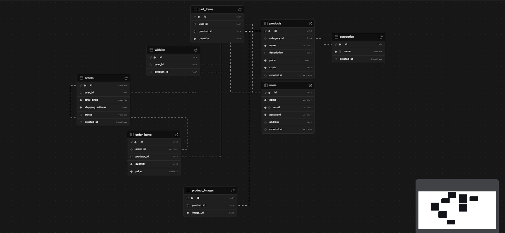

# Flipkart Clone - Full-Stack E-Commerce Platform 🛒

An in-depth, feature-rich, full-stack e-commerce web application inspired by Flipkart. Built with a modern tech stack featuring React.js (Vite), Node.js, Express, Sequelize ORM, and PostgreSQL.


---

## 🌟 Features

### Frontend (Client-Side)
- **Responsive Design:** A fully responsive, modern user interface that works seamlessly across desktops and mobile devices (CSS/CSS Modules).
- **Authentication:** Secure JWT-based Authentication (Login, Registration, Protected Routes).
- **Product Catalog:** Interactive product listings, dynamic category filtering, and detailed individual product views.
- **Cart & Wishlist Logic:** Context API-based state management that seamlessly adds/removes items from the cart or wishlist and links directly with the backend database.
- **Order Management:** Secure checkout, persistent order histories, and responsive cart total calculations.
- **Real-time Feedback:** Toast notifications (`react-toastify`) for interactive user feedback (e.g., "Added to Cart!", "Login Successful!").

### Backend (Server-Side)
- **RESTful API Architecture:** Cleanly separated architecture (Routes, Controllers, Services, Models) for scalability and ease of maintenance.
- **Robust Database Modeling using Sequelize ORM:** Relational database mapping ensuring tight data integrity. Key Entity Relationships include:
  - **1-to-Many:** Users to Orders, Cart Items, and Wishlist Items.
  - **1-to-Many:** Categories to Products.
  - **1-to-Many:** Products to Product Images.
  - **Many-to-Many (via junction tables):** Orders and Products (via `OrderItems`).
- **Security:** Password hashing with `bcryptjs` and session handling via `jsonwebtoken`.
- **Email Services:** Transactional emails or notifications setup via `nodemailer` and `resend`.
- **Data Initialization:** Scripts pre-written for database migrations (`migrate.js`), product seeding (`seed_50_products.js`), and image management (`fix_images.js`, `update_unsplash_images.js`).
- **Postman Collection:** A pre-configured `Flipkart_Clone.postman_collection.json` file is available to easily test API endpoints.

---

## 🛠 Tech Stack

### Frontend
- **Library:** React.js (^19)
- **Tooling:** Vite
- **Routing:** React Router DOM
- **State Management:** React Context API
- **HTTP Client:** Axios
- **Icons & UI:** React Icons, React Toastify
- **Linting:** ESLint

### Backend
- **Environment:** Node.js
- **Framework:** Express.js
- **Database:** PostgreSQL
- **ORM:** Sequelize
- **Security:** bcryptjs, jsonwebtoken, CORS
- **Utilities:** dotenv, nodemailer, resend

---

## 🚀 Environment Setup & Installation

### 1. Prerequisites
- **Node.js** (v18+ recommended)
- **PostgreSQL** (v12+ recommended)
- **Git**

### 2. Backend Setup
1. Open a terminal and navigate to the backend directory:
   ```bash
   cd backend
   ```
2. Install dependencies:
   ```bash
   npm install
   ```
3. Configure Environment Variables:
   Create a `.env` file in the root of the `backend/` directory:
   ```env
   PORT=5000
   DB_HOST=localhost
   DB_PORT=5432
   DB_NAME=flipkart_db
   DB_USER=postgres
   DB_PASSWORD=your_password
   JWT_SECRET=your_super_secret_jwt_key
   ```
4. Database Setup & Seeding:
   Ensure your PostgreSQL server is running and the database specified in `.env` is created.
   - Run the migration to sync tables:
     ```bash
     node migrate.js
     ```
   - Seed the initial data / products:
     ```bash
     node seed_50_products.js
     ```
5. Start the Server:
   ```bash
   # Development mode with nodemon
   npm run dev
   # OR normal start
   npm start
   ```

### 3. Frontend Setup
1. Open a new terminal and navigate to the frontend directory:
   ```bash
   cd frontend
   ```
2. Install dependencies:
   ```bash
   npm install
   ```
3. Configure Environment Variables:
   If your backend is running on a port other than `5000`, configure your API baseURL setup appropriately (e.g. creating a `.env` file in frontend).
4. Run the Development Server:
   ```bash
   npm run dev
   ```

---

## 🌐 Production Notes (Render + Vercel)

Use these settings to avoid intermittent deployment/CORS issues.

### Backend (Render) Environment Variables

Set these in your Render backend service:

```env
FRONTEND_URL=https://flipkart-clone-hazel-nu.vercel.app,https://flipkart-clone.saranshh.me
NODE_ENV=production
```

### Frontend (Vercel) Environment Variable

Set this in your frontend deployment:

```env
VITE_API_URL=https://flipkart-clone-w0a3.onrender.com/api
```

### Uptime Monitor Recommendation

- URL: `https://flipkart-clone-w0a3.onrender.com/health`
- Method: `GET`
- Interval: `5 min`
- Timeout: `20-30s`
- Retries/failure threshold: `2-3`

Use `GET /ready` for readiness checks that also validate database connectivity.

### Quick Error Diagnosis

- `521` (Cloudflare/edge): origin is temporarily unreachable. This is the primary failure.
- CORS error with missing `Access-Control-Allow-Origin`: usually a secondary symptom when an edge error page is returned instead of API JSON.
- `No Listener: tabs:outgoing.message.ready`: typically browser extension noise, not backend API logic.

### Health Check Commands

```bash
curl -i https://flipkart-clone-w0a3.onrender.com/health
curl -i https://flipkart-clone-w0a3.onrender.com/ready
curl -i -H "Origin: https://flipkart-clone.saranshh.me" "https://flipkart-clone-w0a3.onrender.com/api/products?page=1&limit=1"
```

### Request Logging

- Backend request logs are enabled by default to help incident debugging.
- Set `REQUEST_LOGGING=false` in Render env vars if you want to disable them.

---

## 📂 Project Structure


```text
Flipkart/
├── backend/
│   ├── src/
│   │   ├── config/        # Database configurations
│   │   ├── controllers/   # Request handlers for HTTP endpoints
│   │   ├── middleware/    # Auth and Error validation middlewares
│   │   ├── models/        # Sequelize models (User, Product, etc.)
│   │   ├── routes/        # Express router definitions
│   │   ├── services/      # Core business logic separated from controllers
│   │   └── utils/         # Helper functions (e.g., generateOrderId)
│   ├── database/          # Raw SQL files (schema, seed) for reference
│   ├── package.json
│   ├── .env               # API Secrets (Ignored in Git)
│   └── *.js               # Assorted scripts (migrations, seeding, image updates)
└── frontend/
    ├── public/            # Static assets
    ├── src/
    │   ├── assets/        # Images, SVG
    │   ├── components/    # Reusable UI components (Navbar, Footer, ProductCards)
    │   ├── context/       # AuthContext / App state management
    │   ├── pages/         # High-level route views (Home, Cart, Checkout, Login)
    │   ├── services/      # Axios API HTTP caller module
    │   └── App.jsx        # Root component matching routes
    ├── package.json
    └── vite.config.js     # Vite builder config
```

---

## 🧪 API Endpoints Overview

You can import `backend/Flipkart_Clone.postman_collection.json` into Postman to explore and test the following routes:

- **Auth:** `POST /api/auth/register`, `POST /api/auth/login`, `GET /api/auth/me`
- **Products:** `GET /api/products`, `GET /api/products/:id`, `GET /api/categories`
- **Cart:** `GET /api/cart`, `POST /api/cart`, `DELETE /api/cart/:id`
- **Wishlist:** `GET /api/wishlist`, `POST /api/wishlist`, `DELETE /api/wishlist/:id`
- **Orders:** `POST /api/orders` (Checkout), `GET /api/orders` (History)

## 🔮 Future Enhancements
- Integration of a live Payment Gateway (Stripe/Razorpay)
- Admin Dashboard for Product and Order management
- Interactive user reviews and rating systems
- Advanced full-text search and Elasticsearch integration

## 📄 License
This project is licensed under the ISC License.
